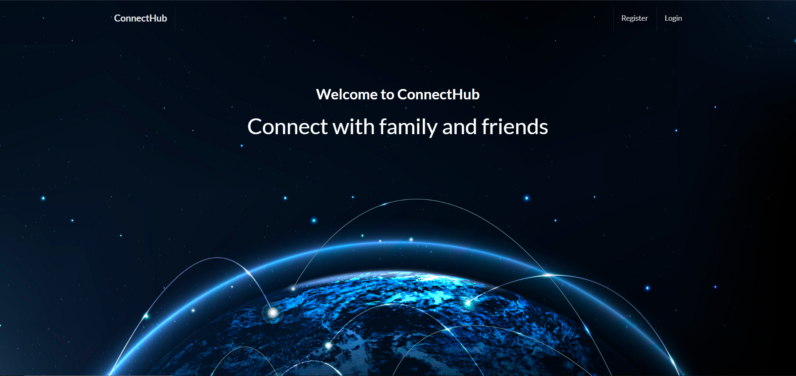

# ConnectHub

ConnectHub is a social media application built with Django that allows users to connect and interact with each other in a seamless and engaging way. This README file provides an overview of the application, its features, and instructions on how to set it up and run it locally.

## Features

ConnectHub comes with the following features:

1. **User Registration and Authentication**: Users can create an account, log in, and securely authenticate themselves. Passwords are hashed and stored securely.

2. **User Profiles**: Each user has a profile that includes basic information such as name, profile picture, and bio. Users can update their profiles and view profiles of other users.

3. **Posts and Feeds**: Users can create posts and upload images. Posts can be liked and commented on. The feed displays a chronological list of posts.

4. **Follow System**: Users can follow and unfollow other users. The number of followers and following users is displayed on each user's profile.

5. **Admin Dashboard**: An admin dashboard is available for managing user accounts and site content.

## Installation

Before running ConnectHub, make sure you have a pre-created MySQL database set up and running. You can configure the database settings in the `settings.py` file.

To run ConnectHub locally, follow these steps:

1. Clone the repository:

`git clone https://github.com/mustashrf/ConnectHub`

2. Change into the project directory:

`cd ConnectHub`

3. Create a virtual environment and activate it:
```
pipenv install
pipenv shell
```

4. Install dependencies:

`pipenv install -r requirements.txt`

5. Set up the database:

`python manage.py migrate`

6. Create a superuser account:

`python manage.py createsuperuser`

7. Start the development server:

`python manage.py runserver`

